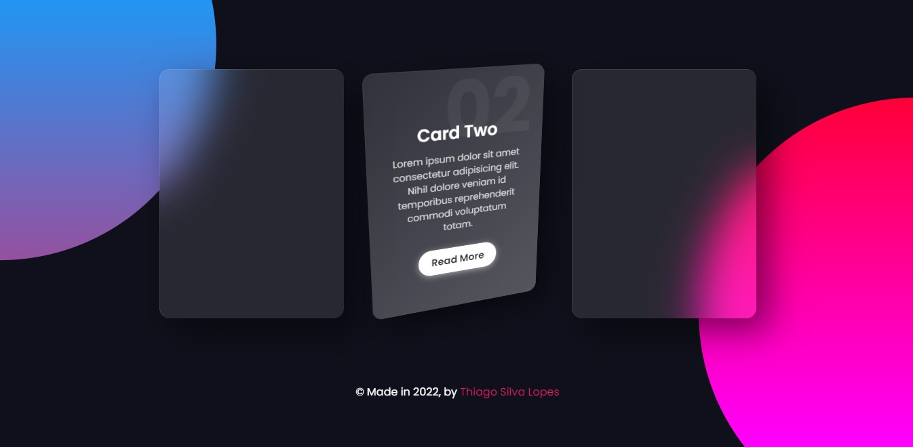

<!---->

# Responsive Cards - 3D Hover Effects

Esse projeto foi feito por: <strong>Thiago Silva Lopes</strong>, em 01/2022, 
tendo como base o <a href="https://www.youtube.com/watch?v=hv0rNxr1XXk" target="_blank">tutorial</a>
do canal do Youtube: <a href="https://www.youtube.com/channel/UCbwXnUipZsLfUckBPsC7Jog" target="_blank">
Online Tutorials</a>

## Demo:
